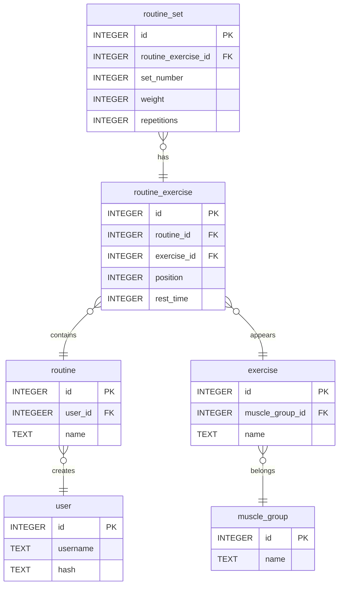

# Fitzz

Fitzz is a web application designed for planning workout routines. It allows users to create, edit, and view their routines, add exercises to them, and define sets with different weights and repetitions. This project was developed as CS50x 2025 final project and showcases the use of **Flask**, **SQLite**, **HTML**/**CSS** and **JavaScript**. It follows a responsive design for use on various devices.

The web application is accessible online [Fitzz on PythonAnywhere](https://ossianpa.pythonanywhere.com/).

## Features

### User Authentication

This functionality consist of the **Sign Up**, **Log In** and **Log Out** pages. Inconsistencies trigger error messages from the server, which appear on a dedicated page.

- **Sign Up**:
  - Prompts the user for their username, password, and password confirmation.
  - Checks that the three input fields have been filled in.
  - Checks that the password and password confirmation match.
  - Checks that the user doesn't already exist.
  - Registers the user by storing the provided information in the database.
  - For the password, its hash is stored instead.

- **Log In**:
  - Similar to Sign Up, but after checking the username and password fields have been filled in, queries the database for the specified username.
  - Checks that the password is correct for the found user.
  - Logs the user in by storing their ID in the Flask session.

- **Log Out**:
  - Logs the user out by clearing the Flask session.

### Routine Gallery

It appears on the main page when the user is logged in, displaying a card-style list of the user's workout routines. Each card shows the exercises included in the routine.

The user can access create, read, update, and delete (CRUD) functionality for routines through this gallery.

### Routine Editor

It allows the user to create and update routines. The user can give the routine a name, add exercises through a dialog, set rest times between sets, reorder and delete added exercises, add or remove sets for each exercise, and specify the weight and repetitions for each added set.

The Routine Editor is a form, where each input element related to an exercise has the prefix `exercise-x-`, with _x_ representing the position of the exercise in the routine. Similarly, each input element related to a set has the prefix `exercise-x-set-y-`, where _x_ indicates the exercise the set belongs to, and _y_ represents the position of the set within the exercise. The number of exercises and sets is also tracked.

This facilitates the processing of the form on the server, maintaining the order and relationships between exercises and sets.

**Adding exercises**

The 'Add exercise' button displays a dialog, which is a card-style list of exercises from the database, organized by muscle group. When the user clicks a card in the dialog, it calls the `addExercise` function in `addExercise.js`, which handles the functionality for adding a specific exercise to a routine. The function performs some the following operations:

- Displays a loader to indicate that the application is working on adding the selected exercise.
- Checks if the ID of the exercise is already in the routine. If it is, an alert is shown, and the operation is terminated.
- Fetches exercise data from the server using the route `/exercise/<int:exercise_id>`, which queries the database for the exercise with the given ID.
- Parses and adds the exercise data to the Routine Editor.

**Reordering and deleting exercises**

The arrow icons allow the user to change the order of an exercise in the routine, and are shown or hidden based on the exercise's position. This functionality is implemented in `moveExercise.js` through `moveExerciseUp` and `moveExerciseDown` functions.

The trash icon next to an exercise allows the user to delete it. This functionality is implemented in `removeExercise.js`.

Both the reorder and delete actions change the original positions of the exercises. The `reindexExercises` function handles this by updating the appropriate exercise prefixes for all input elements after any of these actions.

**Adding and removing sets**

- It follows the same logic as for exercises.
- The plus icon next to an exercise allows the user to add a set to it.
- The trash icon next to a set allows the user to delete it and is shown only if the exercise the set belongs to has more than one set.
- The `reindexSets` function serves as the prefix handler for sets.

**Retrieving routine data**

When the user saves the routine, i.e., when submitting the form, a validation process is performed before inserting into the database. The validation is done on the client-side and also on the server-side to ensure the user cannot bypass it. The validation ensures:
- the routine name is provided.
- there is at least one exercise in the routine.
- each exercise has at least one set.
- the rest time for each exercise is integer, positive, less than 300 seconds, and multiple of 5.
- the weight and repetitions for each set are integer and positive.

### Routine Viewer

It allows the user to view all the information of a routine and can be accessed by clicking on a routine card in the Routine Gallery. The user can also edit or delete the routine from this window.

## Database design

The following shows an ER diagram of the designed database for Fitzz.

## License

This project is licensed under the MIT License. See the [LICENSE](LICENSE) file for details.
